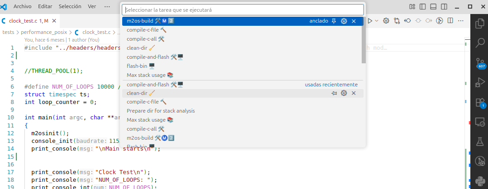

# 

# Usage

Copy the contents of `m2os_automate_scripts/` to the `.vscode` folder inside your `M2OS` directory. 

```
git clone 
cd m2os_automate_scripts
cp *.sh tasks.json <M2OS_DIR>/.vscode/
```

> [!IMPORTANT] Replace M2OS_DIR with the actual path to your M2OS directory.

In order to launch the scripts, you can use the VSCode task runner, pressing `Ctrl+Shift+P` and selecting `Tasks: Run Task`. A list of available tasks will be displayed as shown in the image below.



# Misc links

[M2OS GitLab](https://gitlab.com/marioaldea/M2OS)

[M2OS site](https://m2os.unican.es/)
